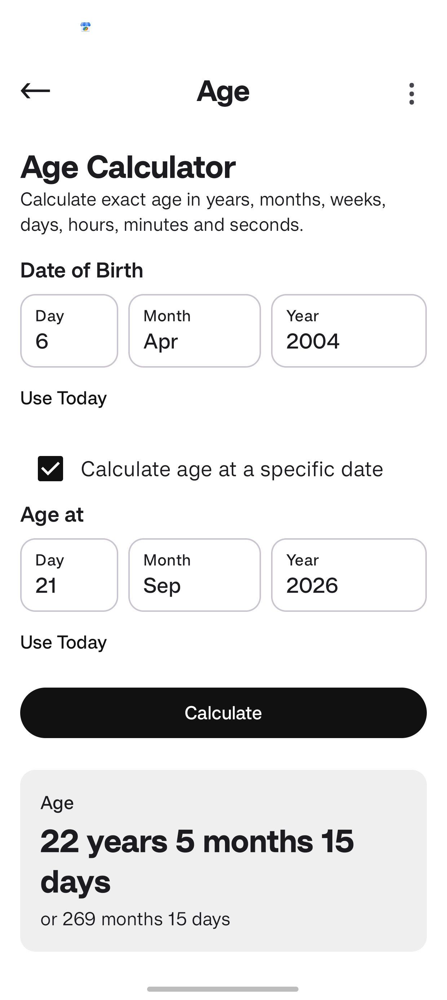
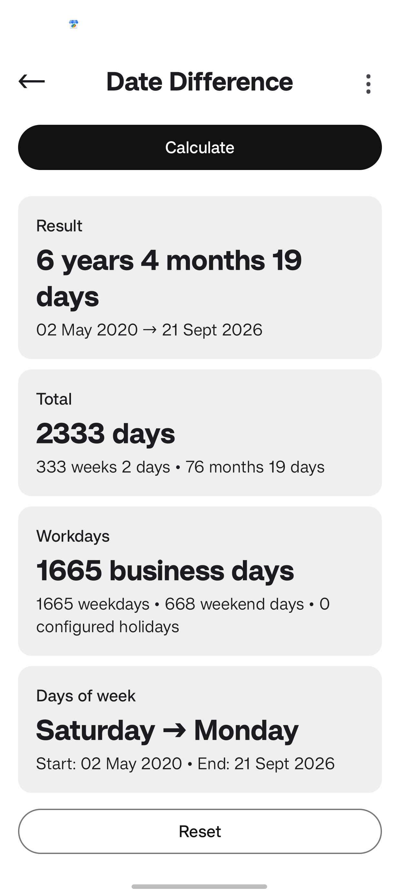
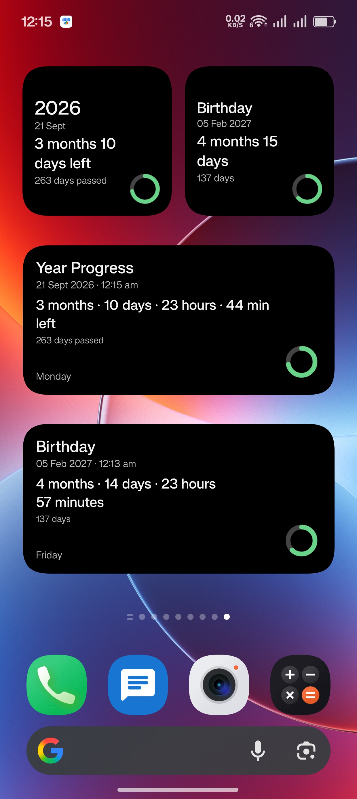

  

<h1 align="center">DayCalcy</h1>

  A simple, private, and completely offline date calculator and reminder app for Android.

  
  
  
  

  <strong>Current version: 3.42.8</strong>

---

## Features

DayCalcy includes:

1. **Age Calculator** — Calculate your exact age.
2. **Date Difference** — Find the number of days between two dates.
3. **Add / Subtract Date** — Add or subtract time from a date.
4. **Day Counter** — Count days from a selected date.
5. **Day of Week** — Find the weekday for any date.
6. **Date Reminder** — Save important dates and see their countdowns.
7. **Calendar** — View dates, reminders, history markers, and yearly reminders.
8. **History** — Automatically keep recent calculation results locally.
9. **Year Progress** — View progress through the selected year.
10. **Widgets** — Home-screen widgets in 2×2 and 4×2 sizes.

## Calendar & Reminders

- Select any date from the calendar.
- View reminders associated with the selected date.
- One-time and yearly recurring reminders are supported.
- Yearly reminders can be used for birthdays, anniversaries, and other recurring dates.
- Reminder notifications work locally on the device.
- Calendar reminder markers distinguish one-time and yearly reminders.
- Tapping a reminder item opens the corresponding reminder in Date Reminder.

## History

Calculation results can be saved automatically to local history.

- View previous calculations.
- Filter and browse saved results.
- Open a history entry to view the exact calculation again.
- History stays on the device.
- No online account or service is required.

## Offline & Privacy

DayCalcy works completely offline.

- No internet connection is required.
- No online APIs or remote services are used.
- Calculations, reminders, and history stay on your device.
- No account is required.
- The app is designed to work without network access.

## Other

- Light and dark mode
- Simple and lightweight interface
- Copy and Share for complete calculation results
- Android home-screen widgets
- Completely offline operation

## Screenshots

### Main & Calculator Screens

| | |
|---|---|
|  |  |
|  |  |

### Reminders & Widgets

| | |
|---|---|
|  |  |
|  |  |

## Download

Download the latest version of DayCalcy from GitHub Releases.

  <a href="../../releases/latest">
    <strong>Download Latest APK</strong>
  </a>

The app works completely offline after installation.

For older versions, visit the [Releases](../../releases) page.

## License

DayCalcy is free and open-source software licensed under the
**GNU General Public License v3.0**.

See [LICENSE](LICENSE) for the full license text.
