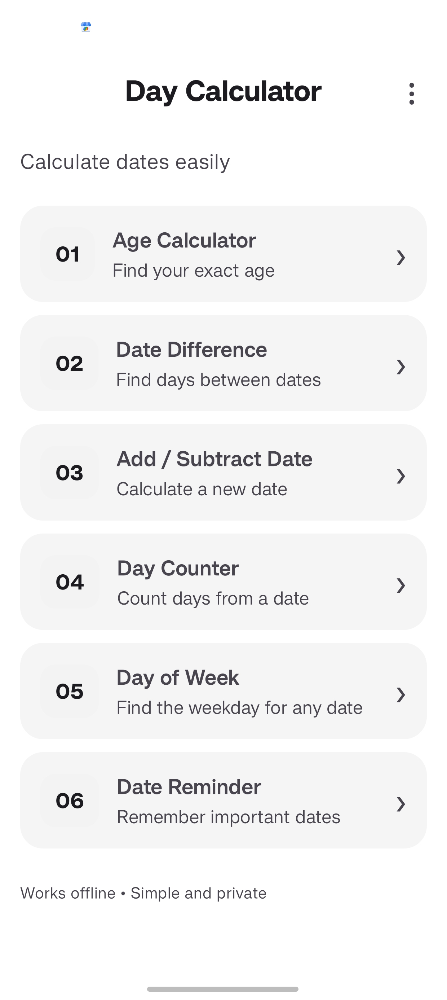
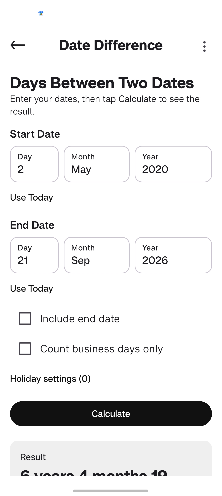
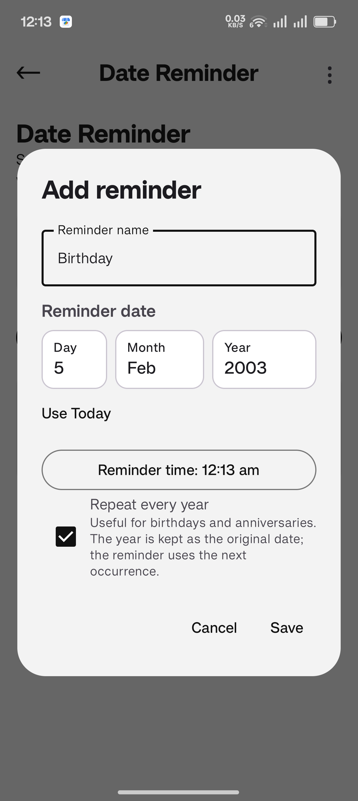
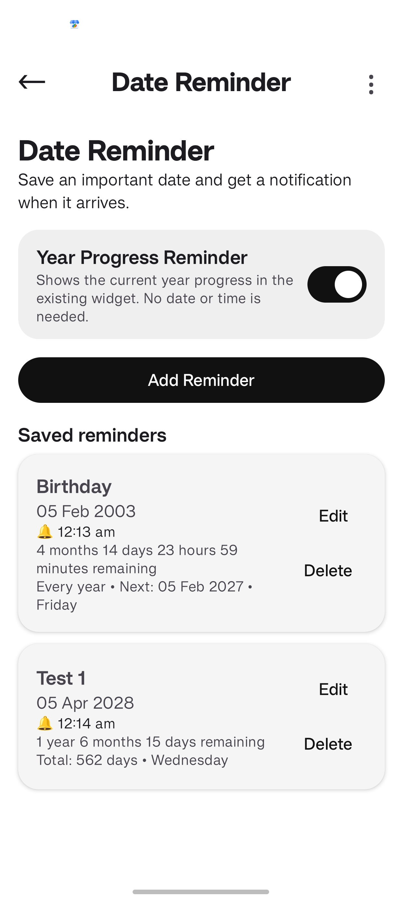
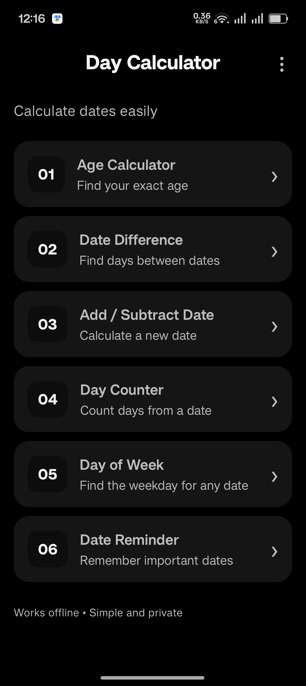

  

<h1 align="center">DayCalcy</h1>

  A simple, private, and completely offline date calculator and reminder app for Android.

  
  
  
  

  <strong>Current version: 3.42.8</strong>

---

## Features

DayCalcy includes:

1. **Age Calculator** — Calculate exact age, including age at a selected date and next-birthday information.
2. **Date Difference** — Calculate the difference between two dates, with an option to include the end date.
3. **Add / Subtract Date** — Add or subtract years, months, weeks, days, and business days from a date.
4. **Day Counter** — Count days between dates, including business-day mode and holiday handling.
5. **Day of Week** — Find the weekday for any date.
6. **Date Reminder** — Create one-time and yearly recurring reminders with local notifications.
7. **Calendar** — Browse dates, reminders, history markers, and yearly reminders.
8. **History** — Automatically save recent calculation results locally, with filters, grouping, reopening, and deletion.
9. **Year Progress** — View progress through the selected year.
10. **Widgets** — Home-screen countdown widgets in 2×2 and 4×2 sizes.
11. **Theme Support** — System, Light, and Dark theme modes.

## Calculators

### Age Calculator

- Exact age in years, months, and days.
- Calculate age at a selected date.
- Next birthday countdown and weekday information.

### Date Difference

- Calculate the difference between two dates.
- Optional include-end-date calculation.
- Business-day calculations.
- Custom holiday support.

### Add / Subtract Date

- Add or subtract years, months, weeks, and days.
- Business-day mode with holiday handling.

### Day Counter

- Count days between selected dates.
- Business-day mode.
- Custom holiday support.

### Day of Week

- Find the weekday for any date.
- Includes useful date information such as day of year, ISO week, and days remaining in the year.

## Calendar & Reminders

- Select any date from the calendar without automatically opening a reminder.
- View reminders and other date information for the selected date.
- Calendar markers distinguish History, one-time reminders, and yearly reminders.
- Yearly reminders appear on the same month and day each year.
- Tap a reminder item to open the corresponding reminder in Date Reminder.
- Returning from a reminder preserves the Calendar state.
- Multiple reminders can be shown for the same date.
- Reminder notifications work locally on the device.
- Reminder actions include Done and Snooze.
- Deleted reminders cancel their already-posted notifications.
- Reminder scheduling includes exact-alarm handling with an inexact fallback when exact alarms are unavailable.
- Reminders are restored and rescheduled after relevant device time, timezone, and reboot events.
- When opening a specific reminder from Calendar, Date Reminder automatically scrolls to it and briefly highlights it with a soft theme-aware color.

## History

Calculation results can be saved automatically to local history.

- Recent calculations are stored on the device.
- Filters and grouping make saved calculations easier to browse.
- Open a history entry to view the exact calculation again.
- Individual entries can be deleted.
- History is limited to the most recent 100 entries.
- History does not continuously save Year Progress screens.

## Year Progress

- View progress through the selected year.
- Calendar Information can show Year Progress for the selected date.
- Year Progress notifications and widget support are available.

## Widgets

- 2×2 countdown widget.
- 4×2 wide countdown widget.
- Multiple widget instances can use different saved reminders/dates.
- Countdown information updates locally.
- Progress ring support.
- Light and Dark widget appearance follows the DayCalcy theme.
- Widgets remain completely offline.

## Results & Sharing

- Copy the complete calculation result with one Copy action.
- Share the complete calculation result with one Share action.
- Actions are shown once for the complete result rather than repeated on every result section.

## Offline & Privacy

DayCalcy works completely offline.

- No internet connection is required.
- No online APIs or remote services are used.
- No analytics or account is required.
- Calculations, reminders, history, and settings stay on the device.
- The app is designed to work without network access.

## Other

- System, Light, and Dark themes.
- About section with Changelog.
- Local reminder notifications.
- Simple and lightweight interface.

## Screenshots

### Main & Calculator Screens

| | |
|---|---|
|  |  |
|  |  |

### Reminders & Widgets

| | |
|---|---|
|  |  |
|  |  |

## Download

Download the latest version of DayCalcy from GitHub Releases.

  <a href="../../releases/latest">
    <strong>Download Latest APK</strong>
  </a>

The app works completely offline after installation.

For older versions, visit the [Releases](../../releases) page.

## License

See [LICENSE](LICENSE) for license details.
